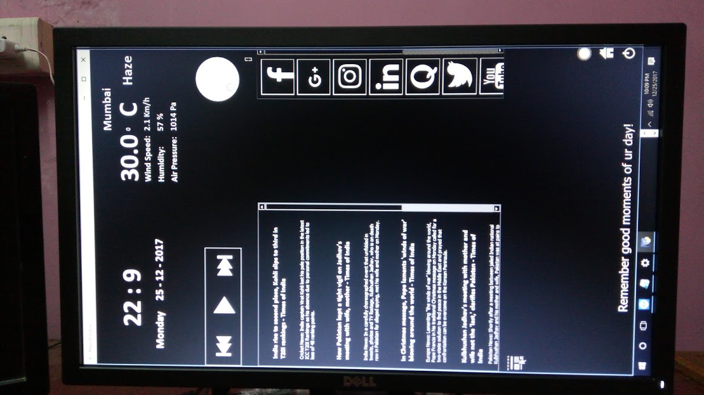

# SmartMirror
Our final year project "Smart Mirror". 
After done with hardware part of our project we started with software part. 
We used weather api to get current weather of city, news api to get news from Times Of India. 
If you want to add music of your own then add to the main directory were practise.py lies. 
The UI is made so that it can be used from touch screen(IR Frame in our case). 
The file "practise.py" is the main file which has all the code that runs UI.  
Code is not very efficient and may have few bugs. 
Many different libraries are used to make the program including pyqt5 and pygame. 
As the Smart mirror should be reflective the background of UI is kept black. 
Screenshot of UI:   
 </img> 
You can watch more pics regarding this project but there are many irrelevant pics to.....@: https://photos.app.goo.gl/qsygO4fTfPfl1i8i2 
